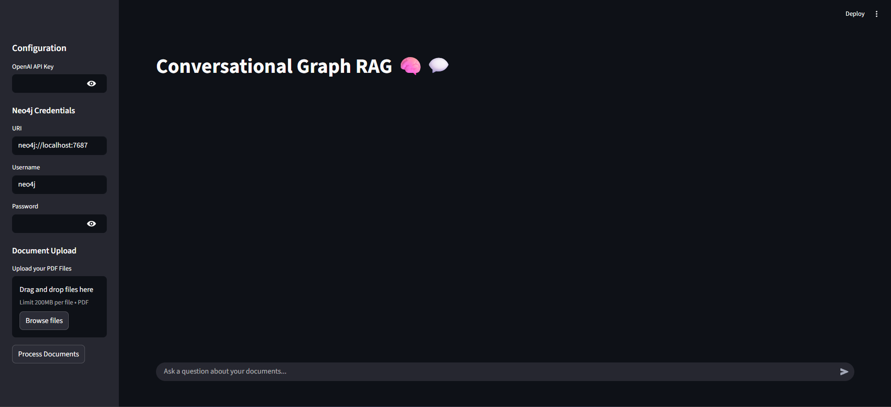
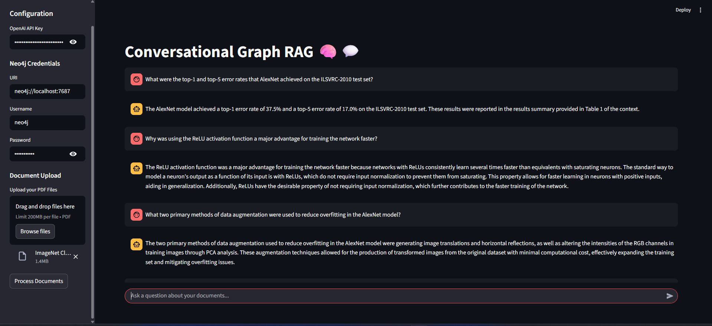
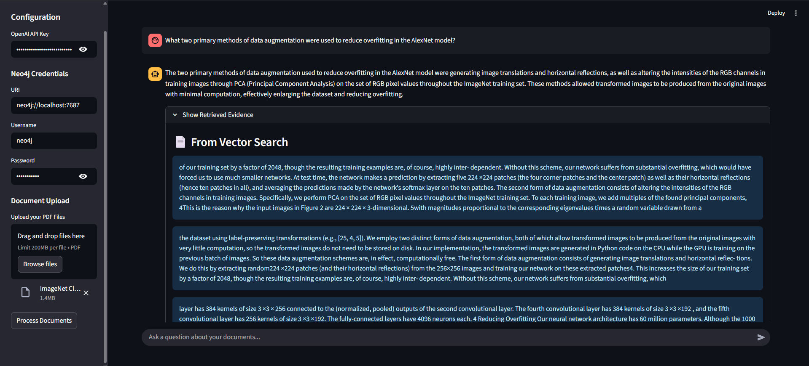
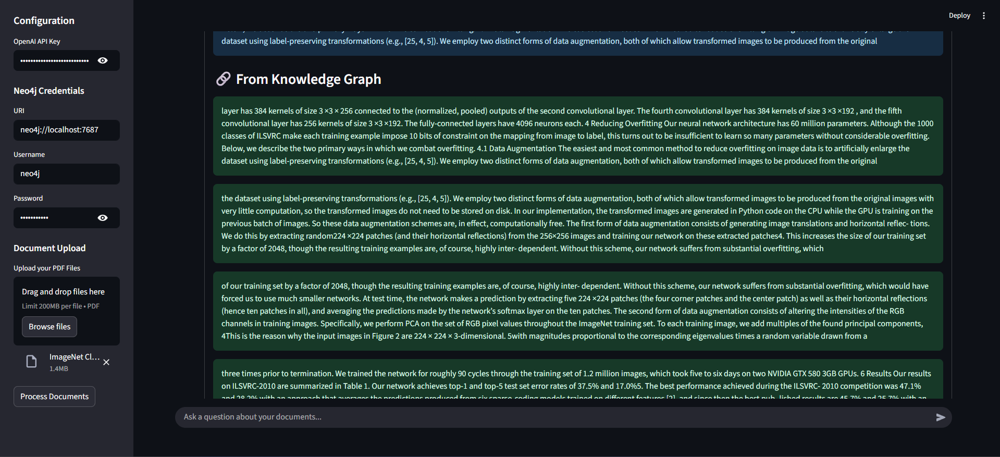

# X-RAG: Explainable Hybrid Retrieval-Augmented Generation 🧠💬

<div align="center">

[](https://www.python.org/downloads/)
[](https://opensource.org/licenses/MIT)
[](https://www.langchain.com/)
[](https://streamlit.io)
[](https://neo4j.com)

</div>

An advanced Retrieval-Augmented Generation (RAG) system that answers questions based on uploaded PDF documents. It uniquely combines the power of semantic vector search with structured knowledge graph retrieval to provide highly accurate, context-aware, and explainable answers.

<br>
<p align="center">
  
</p>

## Table of Contents

- [About The Project](#about-the-project)
- [Key Features](#key-features)
- [How It Works](#how-it-works)
- [Screenshots](#screenshots)
- [Tech Stack](#tech-stack)
- [Getting Started](#getting-started)
  - [Prerequisites](#prerequisites)
  - [Installation](#installation)
- [Usage](#usage)
- [Documents Tested](#documents-tested)

## About The Project

Traditional RAG systems rely solely on semantic similarity, which can sometimes miss structured facts or relationships within a document. X-RAG enhances this process by building a dynamic **Knowledge Graph** on the fly. This hybrid approach allows the system to not only find semantically relevant text chunks but also query for explicit relationships between entities, leading to more robust and comprehensive answers.

## Key Features

-   **🧠 Hybrid Retrieval:** Fuses **FAISS** vector search for semantic context with **Neo4j** graph search for factual, entity-based relationships.
-   **✨ Dynamic Knowledge Graph:** Automatically extracts key entities from documents using **spaCy** and populates them into a graph structure in real-time.
-   **💬 Conversational Memory:** Remembers the context of recent interactions, allowing for natural, follow-up questions.
-   **🔬 Explainable AI (XAI):** For transparency, the application displays the exact source chunks retrieved from both the vector store and the knowledge graph that were used to formulate the answer.
-   **🚀 Interactive UI:** A clean and user-friendly interface built with **Streamlit** for easy document uploads and conversational Q&A.

## How It Works

The application follows a complete RAG pipeline from data ingestion to answer generation:

1.  **Data Ingestion**: PDFs are uploaded through the Streamlit interface.
2.  **Text Processing**: The raw text is extracted and split into smaller, manageable chunks.
3.  **Knowledge Base Creation**:
    -   **Vector Store**: Text chunks are converted into embeddings using OpenAI and stored in a FAISS vector store for semantic search.
    -   **Knowledge Graph**: Entities (like names, places, concepts) are extracted from each chunk and stored in a Neo4j graph, linking chunks to the entities they mention.
4.  **Hybrid Retrieval**: When a user asks a question:
    -   The system performs a similarity search against the FAISS vector store.
    -   It also extracts entities from the question and queries the Neo4j graph to find chunks where these entities co-exist.
5.  **Augmented Generation**: The retrieved context from both sources is combined with the user's question and chat history, and sent to an OpenAI model to generate a final, synthesized answer.

## Screenshots

<div align="center">
  <h3>Screenshots</h3>
  <table border="0" cellspacing="10" cellpadding="10">
    <tr>
      <td align="center">
        <strong>Conversational Q&A Interface</strong><br><br>
        
      </td>
      <td align="center">
        <strong>Easy Configuration & Upload</strong><br><br>
        
      </td>
    </tr>
    <tr>
      <td align="center">
        <strong>Evidence from Vector Search</strong><br><br>
        
      </td>
      <td align="center">
        <strong>Evidence from Knowledge Graph</strong><br><br>
        
      </td>
    </tr>
  </table>
</div>
## Tech Stack

-   **Backend:** Python
-   **LLM Orchestration:** LangChain
-   **Vector Database:** FAISS
-   **Graph Database:** Neo4j
-   **Language Model:** OpenAI
-   **UI Framework:** Streamlit
-   **PDF Processing:** PyPDF
-   **NLP for Entity Extraction:** spaCy

## Getting Started

Follow these steps to set up and run the project locally.

### Prerequisites

-   Python 3.9+
-   Git
-   Neo4j Desktop (or a running Neo4j instance)

### Installation

1.  **Clone the repository:**
    ```bash
    git clone [https://github.com/mohitrock850/X-RAG-Explainable-Hybrid-Retrieval-Augmentation-with-Knowledge-Graphs.git](https://github.com/mohitrock850/X-RAG-Explainable-Hybrid-Retrieval-Augmentation-with-Knowledge-Graphs.git)
    cd X-RAG-Explainable-Hybrid-Retrieval-Augmentation-with-Knowledge-Graphs
    ```

2.  **Create and activate a virtual environment:**
    ```bash
    # Create the environment
    python -m venv venv

    # Activate on Windows
    .\venv\Scripts\activate
    
    # Activate on macOS/Linux
    source venv/bin/activate
    ```

3.  **Install the required packages:**
    ```bash
    pip install -r requirements.txt
    ```

4.  **Download the spaCy NLP model:**
    ```bash
    python -m spacy download en_core_web_lg
    ```

## Usage

1.  **Launch the Streamlit application** (ensure your virtual environment is activated):
    ```bash
    streamlit run app.py
    ```
2.  Open your web browser to the local URL provided (usually `http://localhost:8501`).
3.  In the sidebar, enter your **OpenAI API Key** and your **Neo4j Credentials**.
4.  Upload one or more PDF files.
5.  Click the **"Process Documents"** button and wait for the knowledge base to be built.
6.  Start asking questions in the chat box!

## Documents Tested

This system has been successfully tested on complex technical papers, including:
-   `Attention is all You Need.pdf`
-   `ImageNet Classification with Deep CNN.pdf`
